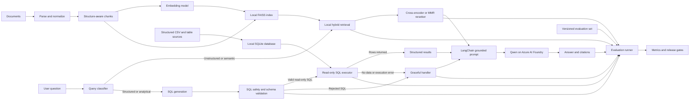

## Design goals

The system must produce grounded answers with traceable citations and make every
pipeline change measurable. Retrieval, reranking, and generation are evaluated
separately so a quality regression can be assigned to the correct stage.

## Architecture

### 1. Unified query flow in LangGraph


The query classifier is the starting node for request-time orchestration.
It routes each question to the retrieval path or text-to-SQL path based on
intent, then both paths converge at a shared grounded generation stage.

### Ingestion and indexing

1. Load text, PDF etc. documents directly from Hugging face or Kaggle hub. 
2. Normalize text while preserving titles, headings, tables, page numbers,
   publication dates, source URLs, and access-control metadata.
3. Split on document structure first, then apply token-aware chunk limits. Store
   parent section IDs so a precise chunk can be expanded with nearby context.
4. Deduplicate content, assign stable document and chunk IDs, and record a corpus
   version.
5. Generate embeddings and write text, vectors, and metadata to FAISS.

### Retrieval and reranking

FAISS is the vector index and primary retrieval engine. Metadata and lexical
signals are handled locally in the application layer using SQLite FTS5 or a
BM25 library, then fused with vector results before reranking.

1. Apply access-control, domain, source, and date filters before retrieval.
2. Run vector similarity in FAISS and lexical search in SQLite FTS5 together.
3. Fuse candidates with reciprocal rank fusion and retain approximately 50
   candidates.
4. Apply a local reranker such as a cross-encoder or MMR diversification as the
   second stage.
5. Send the best 5 to 8 non-duplicate chunks, including citation metadata, to
   the generator.

This choice keeps retrieval fully local and reproducible for evaluation.
If offline results justify extra latency, a stronger local cross-encoder can be
introduced behind the same reranker interface.

### 2. Text-to-SQL on local structured data

Use a local SQLite database for structured tables so the system can answer
analytical questions through SQL generation and execution.

1. Ingest curated CSV sources into SQLite with stable table names and explicit
   column types.
2. Create primary keys, foreign keys where applicable, and indexes on common
   filter and join columns.
3. Enable SQLite FTS5 virtual tables for free-text columns when natural-language
   lookup is needed before SQL generation.
4. Maintain a schema registry with table descriptions, column semantics, units,
   and allowed filters.
5. Build a text-to-SQL chain that generates parameterized SQL from user intent,
   validates against the schema, executes in read-only mode, and returns both
   results and executed SQL.
6. Add SQL safety guards: allowlisted tables, query timeout, row limits,
   restricted functions, and deterministic error handling.

#### Query classifier and routing

1. Add a query-classifier node as the first runtime step.
2. Route semantic and document-grounded questions to FAISS plus reranking.
3. Route structured, numerical, and aggregation-style questions to text-to-SQL.
4. Return classifier labels and confidence as trace metadata for evaluation and
   troubleshooting.

#### SQL generation, validation, and safety

1. Generate SQL only from an allowlisted schema registry.
2. Validate generated SQL against an AST-based policy before execution.
3. Enforce read-only mode by permitting SELECT statements only.
4. Reject unsafe constructs such as DDL, DML, PRAGMA writes, ATTACH, and
   multi-statement execution.
5. Apply hard limits for timeout, maximum scanned rows, and returned rows.

#### Graceful no-data and error handling

1. If execution returns no rows, return a structured no-data signal with a
   suggested refinement prompt.
2. If validation fails, do not hit the database and return a safe explanation.
3. If execution errors occur, capture normalized error types and route to a
   graceful handler node.
4. The graceful handler can retry once with constrained SQL regeneration or
   fall back to a clarifying response that avoids fabricated results.
5. Pass handler outputs to the common generation node so final responses remain
   consistent with citation and abstention rules.

Evaluate text-to-SQL with exact-match SQL, execution accuracy, and answer
correctness on held-out analytical questions. Track failure categories such as
wrong joins, aggregation errors, and filter leakage.

### Generation

LangChain builds the grounded prompt, invokes a Qwen instruct model, and parses the structured response. The
prompt requires the model to:

* Answer only from supplied context
* Cite stable chunk IDs for factual claims
* Identify conflicting evidence
* Abstain when the retrieved evidence is insufficient

### Orchestration

LangGraph is used to orchestrate model invocation steps in the pipeline.

## Evaluation-first workflow

Create the evaluation dataset before optimizing the pipeline. Each case records
the question, required facts or reference answer, relevant document and chunk
IDs, answerability, category, difficulty, and corpus version. Include factual,
multi-document, numerical, temporal, ambiguous, adversarial, and unanswerable
questions.

| Stage | Primary metrics |
|-------|-----------------|
| Ingestion | Parse success, metadata completeness, duplicate rate |
| Initial retrieval | Recall@k, MRR, nDCG@k, latency |
| Reranking | Recall@k, nDCG@k, context precision, rank lift |
| Generation | Correctness, completeness, answer relevance |
| Grounding | Faithfulness, citation precision, citation completeness |
| Abstention | Unsupported-claim rate, answerable and unanswerable accuracy |
| Operations | p50/p95 latency, tokens per query, cost per query, failure rate |

Use deterministic evaluators for retrieval, citations, exact facts, and numeric
values. Use DeepEval for model-graded metrics and CI assertions, and use
LangSmith for LangChain traces, datasets, and experiment comparison. Configure
judge models through replaceable adapters and calibrate their scores against a
human-labeled sample. Store every run with the dataset, corpus, index, chunking,
embedding, prompt, Qwen deployment, judge model, and evaluator versions.

A release candidate must not regress the locked test set beyond agreed
thresholds for retrieval recall, faithfulness, citation correctness,
unsupported claims, latency, or cost. Tune one pipeline stage at a time and use
paired per-question comparisons instead of aggregate scores alone.

## Technology stack

| Area | Choice | Purpose |
|------|--------|---------|
| Language | Python 3.14 | Application, ingestion, and evaluation runtime |
| RAG orchestration | LangChain | Loaders, retriever composition, prompts, and generation chains |
| Generation model | Qwen instruct model on Azure AI Foundry | Grounded answer generation |
| Foundry integration | `langchain-azure-ai`, `azure-ai-inference` | LangChain model adapter and Azure endpoint client |
| Identity | Key-based | |
| Vector index | FAISS | Local vector similarity search |
| Lexical retrieval | SQLite FTS5 | Local BM25-style keyword retrieval |
| SQL | SQLite3 | Local text-to-SQL execution engine |
| Embeddings | Sentence Transformers (Experimental), Embedding model in Azure AI Foundry (Stable) | Generate embeddings for similarity search |
| Parsing | PyPDF, Beautiful Soup, lxml | PDF, HTML, Wikipedia, and plain-text ingestion |
| Evaluation | DeepEval, LangSmith, pytest | Provider-neutral RAG metrics, experiments, regression suites, and deterministic checks |
| API | FastAPI and Uvicorn | Query and health endpoints |
| Configuration | Pydantic Settings and python-dotenv | Typed settings and local environment loading |
| Resilience | Tenacity and HTTPX | Retries, timeouts, and HTTP access |
| Observability | OpenTelemetry | Traces, latency, failures, and dependency telemetry |
| Quality tools | Ruff, pytest | Static checks and automated tests |

## Runtime configuration

Keep credentials out of source control. The initial application configuration
should include these settings:

```text
AZURE_AI_FOUNDRY_ENDPOINT
AZURE_AI_FOUNDRY_QWEN_DEPLOYMENT
AZURE_AI_FOUNDRY_EMBEDDING_ENDPOINT
AZURE_AI_FOUNDRY_EMBEDDING_DEPLOYMENT
FAISS_INDEX_PATH
SQLITE_DB_PATH
```

Use `DefaultAzureCredential` in local and hosted environments. API keys may be
supported for local experiments, but managed identity should be the deployment
default.
