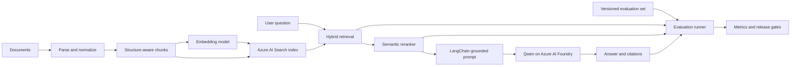

## Design goals

The system must produce grounded answers with traceable citations and make every
pipeline change measurable. Retrieval, reranking, and generation are evaluated
separately so a quality regression can be assigned to the correct stage.

## Architecture



### Ingestion and indexing

1. Load text, HTML, and PDF documents with source-specific loaders.
2. Normalize text while preserving titles, headings, tables, page numbers,
   publication dates, source URLs, and access-control metadata.
3. Split on document structure first, then apply token-aware chunk limits. Store
   parent section IDs so a precise chunk can be expanded with nearby context.
4. Deduplicate content, assign stable document and chunk IDs, and record a corpus
   version.
5. Generate embeddings and write text, vectors, and metadata to Azure AI Search.

### Retrieval and reranking

Azure AI Search is the vector index and retrieval engine. Its LangChain
`AzureSearch` integration supports metadata filtering and hybrid retrieval in a
single managed service.

1. Apply access-control, domain, source, and date filters before retrieval.
2. Run vector similarity and BM25 keyword search together.
3. Fuse candidates with reciprocal rank fusion and retain approximately 50
   candidates.
4. Apply Azure AI Search semantic ranking as the second-stage reranker.
5. Send the best 5 to 8 non-duplicate chunks, including citation metadata, to
   the generator.

This choice avoids a separate reranking service for the first release. A
cross-encoder can replace the semantic ranker later if offline results show a
material improvement for the target domain.

### Generation

LangChain builds the grounded prompt, invokes a Qwen instruct model deployed to
an Azure AI Foundry model endpoint, and parses the structured response. The
prompt requires the model to:

* Answer only from supplied context
* Cite stable chunk IDs for factual claims
* Identify conflicting evidence
* Abstain when the retrieved evidence is insufficient

Use `AzureAIChatCompletionsModel` from `langchain-azure-ai` with the Foundry
endpoint and Microsoft Entra ID authentication. Keep the selected Qwen model and
deployment name configurable. Use a separate embedding deployment because the
embedding model defines the index vector dimensions and lifecycle.

## Evaluation-first workflow

Create the evaluation dataset before optimizing the pipeline. Each case records
the question, required facts or reference answer, relevant document and chunk
IDs, answerability, category, difficulty, and corpus version. Include factual,
multi-document, numerical, temporal, ambiguous, adversarial, and unanswerable
questions.

| Stage | Primary metrics |
|-------|-----------------|
| Ingestion | Parse success, metadata completeness, duplicate rate |
| Initial retrieval | Recall@k, MRR, nDCG@k, latency |
| Reranking | Recall@k, nDCG@k, context precision, rank lift |
| Generation | Correctness, completeness, answer relevance |
| Grounding | Faithfulness, citation precision, citation completeness |
| Abstention | Unsupported-claim rate, answerable and unanswerable accuracy |
| Operations | p50/p95 latency, tokens per query, cost per query, failure rate |

Use deterministic evaluators for retrieval, citations, exact facts, and numeric
values. Use DeepEval for model-graded metrics and CI assertions, and use
LangSmith for LangChain traces, datasets, and experiment comparison. Configure
judge models through replaceable adapters and calibrate their scores against a
human-labeled sample. Store every run with the dataset, corpus, index, chunking,
embedding, prompt, Qwen deployment, judge model, and evaluator versions.

A release candidate must not regress the locked test set beyond agreed
thresholds for retrieval recall, faithfulness, citation correctness,
unsupported claims, latency, or cost. Tune one pipeline stage at a time and use
paired per-question comparisons instead of aggregate scores alone.

## Technology stack

| Area | Choice | Purpose |
|------|--------|---------|
| Language | Python 3.11 | Application, ingestion, and evaluation runtime |
| RAG orchestration | LangChain | Loaders, retriever composition, prompts, and generation chains |
| Generation model | Qwen instruct model on Azure AI Foundry | Grounded answer generation |
| Foundry integration | `langchain-azure-ai`, `azure-ai-inference` | LangChain model adapter and Azure endpoint client |
| Identity | Key-based | |
| Vector and text index | FAISS | Vector search, BM25 |
| Embeddings | Dedicated embedding model in Azure AI Foundry | Stable vectors independent of the Qwen generation deployment |
| Parsing | PyPDF, Beautiful Soup, lxml | PDF, HTML, Wikipedia, and plain-text ingestion |
| Evaluation | DeepEval, LangSmith, pytest | Provider-neutral RAG metrics, experiments, regression suites, and deterministic checks |
| API | FastAPI and Uvicorn | Query and health endpoints |
| Configuration | Pydantic Settings and python-dotenv | Typed settings and local environment loading |
| Resilience | Tenacity and HTTPX | Retries, timeouts, and HTTP access |
| Observability | OpenTelemetry | Traces, latency, failures, and dependency telemetry |
| Quality tools | Ruff, pytest | Static checks and automated tests |

## Runtime configuration

Keep credentials out of source control. The initial application configuration
should include these settings:

```text
AZURE_AI_FOUNDRY_ENDPOINT
AZURE_AI_FOUNDRY_QWEN_DEPLOYMENT
AZURE_AI_FOUNDRY_EMBEDDING_ENDPOINT
AZURE_AI_FOUNDRY_EMBEDDING_DEPLOYMENT
```

Use `DefaultAzureCredential` in local and hosted environments. API keys may be
supported for local experiments, but managed identity should be the deployment
default.

## Initial delivery sequence

1. Build a small, expert-reviewed evaluation set and immutable corpus snapshot.
2. Implement ingestion with stable IDs and structure-aware chunking.
3. Establish the Azure AI Search hybrid baseline and measure Recall@k.
4. Enable semantic reranking and measure rank lift and context precision.
5. Add the LangChain Qwen generation chain with citations and abstention.
6. Add end-to-end evaluation, tracing, and release thresholds.
7. Promote reviewed production failures into the tuning dataset.